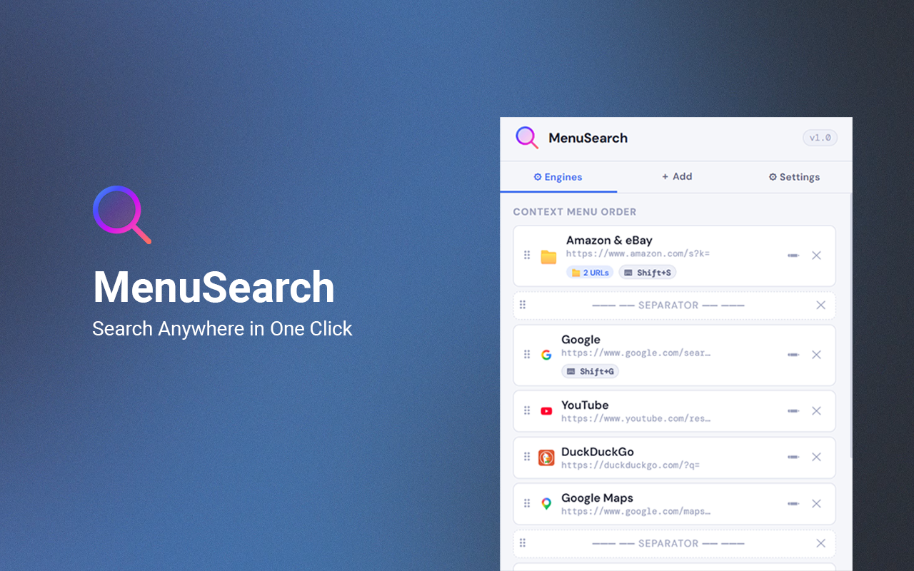
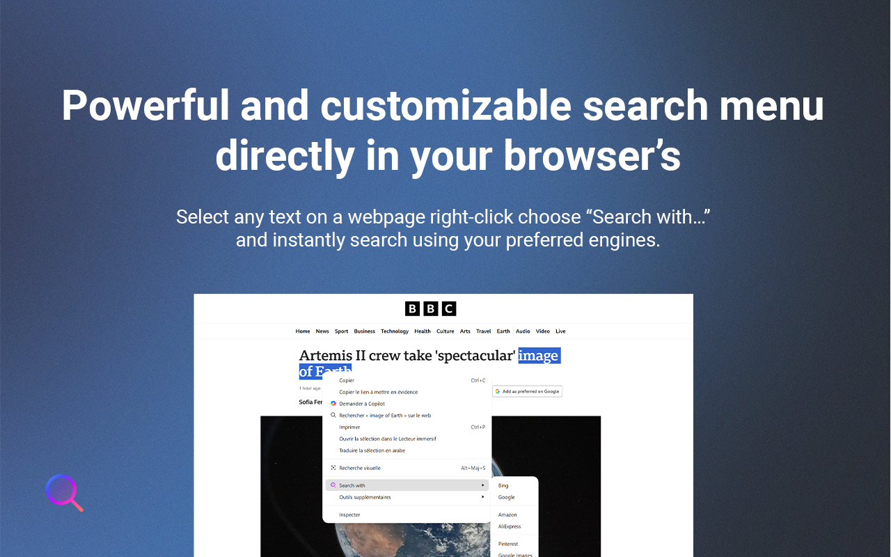
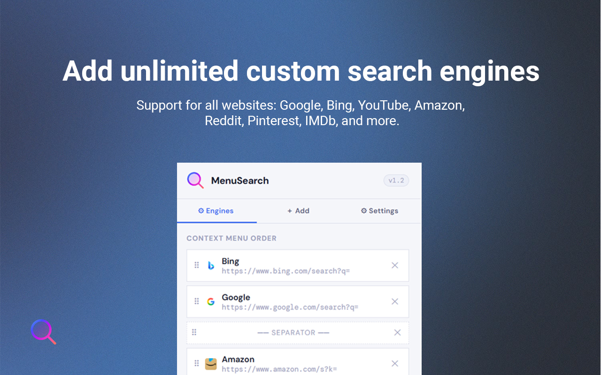
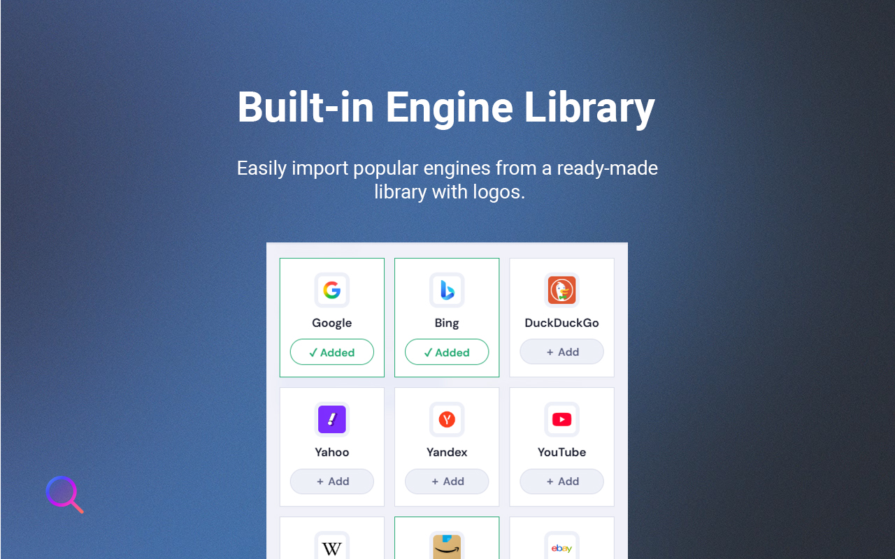
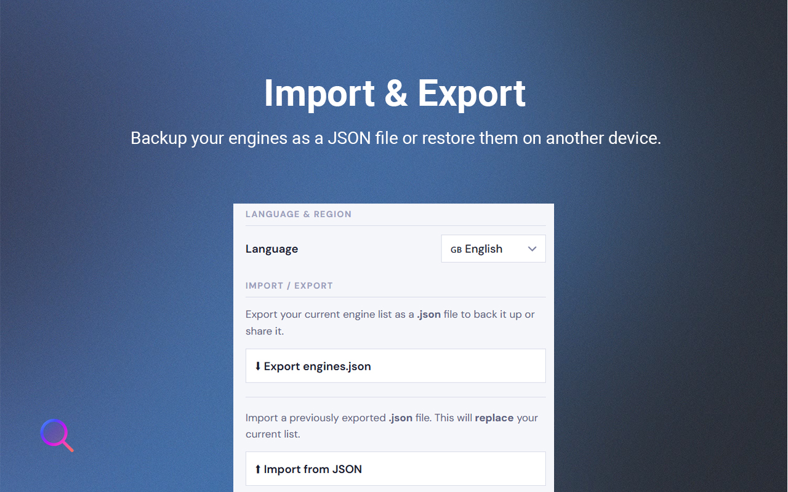
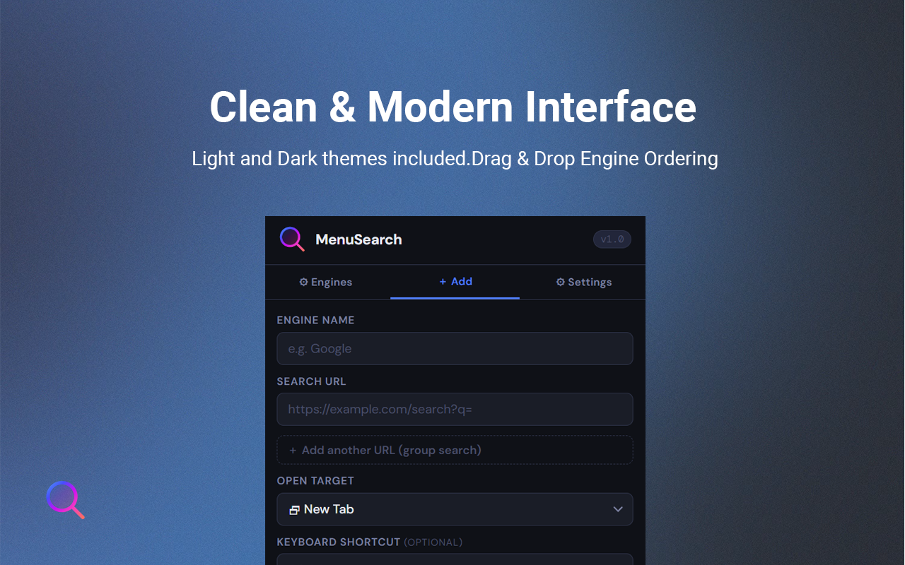

# 🔍 MenuSearch — Search Anywhere in One Click

Stop wasting time copying, pasting, and switching tabs.  
**MenuSearch lets you search selected text instantly across all your favorite platforms — directly from the right-click menu.**

---

## ⚡ Why MenuSearch?

Normally, searching means:  
1. Copy text  
2. Open a new tab  
3. Go to a website  
4. Paste  
5. Search  

**With MenuSearch:**  
**Select → Right click → Search**

Save time, reduce repetitive work, and boost your productivity.

---

## 🚀 Key Features

- 🔗 **Group Search**: Group URLs to search multiple sites in a single action
- ⌨️ **Keyboard Shortcuts**: Launch searches instantly without using the mouse  
- ➕ **Add Custom Engines**: Add unlimited custom search engines  
- 🎯 **Target Options**: Open searches in a new tab or the same tab 
- ✏️ **Edit Saved Engines**: Modify any saved engine with a single clic 
- 🧩 **Organize Easily**: Drag & drop to reorder engines, insert separators  
- 🌙 **Light & Dark UI**: Modern, clean, and user-friendly  
- 🔄 **Import / Export**: Save and transfer your setup across devices  
- 🔐 **Privacy First**: 100% private, no tracking or analytics

---

## 📸 Screenshots

  
  
  
  
  


---

## 🧠 Real Use Cases

- 👨‍💻 **Developers**: Search code across GitHub, StackOverflow, and docs simultaneously  
- 🛒 **Shoppers**: Compare products across multiple stores in one click  
- 🎓 **Students**: Quickly search definitions, papers, and videos across sources  
- 📊 **Professionals**: Save hours switching between tools every week

---

## ⏱ How It Works

1. Select any text on a webpage  
2. Right-click → **Search with…**  
3. Choose your search engine (single or multi-link)  
4. Search opens instantly in your chosen target (tab, same tab, or side panel)  
5. Optional: Use keyboard shortcuts for instant search

---
## 📦 Installation

### ✅ Microsoft Edge Add‑ons Store  
*(Link will be added when published)*

### ✅ Chrome Web Store  
*(Link will be added when published)*

### ✅ Manual Installation (Developer Mode)

1. Download or clone this repository:  
   ```sh
   git clone https://github.com/hassananayi/MenuSearch.git
   ```

2. Open the Edge/Chrome extensions page:  
   ```
   edge://extensions/
   ```

3. Enable **Developer mode**

4. Click **Load unpacked**

5. Select this folder  **MenuSearch**

---


## 🤝 Contributing

Pull requests are welcome!  
Add new engines, improve UI, or translate the extension.

---

## 📄 License

This project is licensed under the MIT License - see the [LICENSE](https://opensource.org/licenses/MIT) file for details.

---

## 🔐 Privacy

All data stays on your device.  
No tracking, no analytics, ever.

---

## 💡 Tip

Enable keyboard shortcuts and multi-link searches to **triple your search speed** and drastically reduce repetitive work.